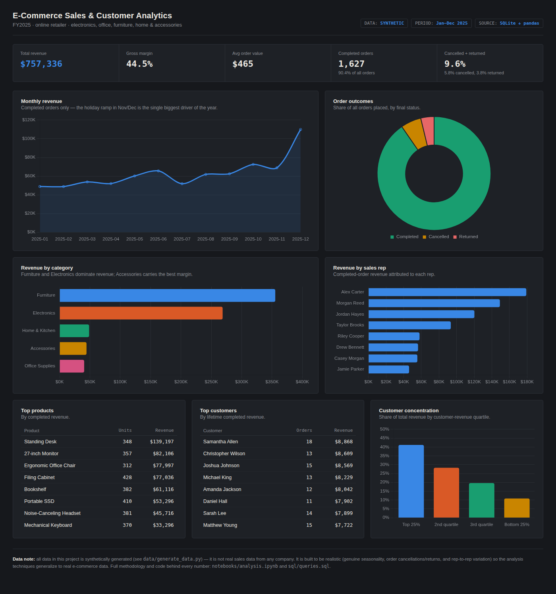

# E-Commerce Sales & Customer Analytics

**Live dashboard:** 
*(link goes live once **Live dashboard:** <https://jeffholtzanalysis.github.io/ecommerce-sales-analytics/dashboard.html> *(link goes live once GitHub Pages is enabled for this repo — see [Deploying your own copy](#deploying-your-own-copy) below)* Pages is enabled for this repo — see [Deploying your own copy](#deploying-your-own-copy) below)*

An end-to-end data analysis project simulating one fiscal year of orders for
a mid-size online retailer: a reproducible synthetic dataset, a Python/pandas
analysis notebook, SQL queries, and a live HTML dashboard — built to
demonstrate the kind of analysis a Data Analyst does day to day: turning raw
transactional data into specific, prioritized business recommendations.



## Business question

Where is revenue coming from, which products, categories, and customers
drive it, and where should the business focus — marketing, staffing, or
inventory — to grow it further?

## Key findings

- **$757,336 in revenue** across 1,627 completed orders in FY2025, at a
  **44.5% gross margin** and a **$465 average order value**.
- **9.6% of orders never convert to revenue** — 5.8% cancelled, 3.8%
  returned, representing **$82.2K in order value placed but never
  fulfilled**. That's large enough to be worth a root-cause look at
  checkout and post-purchase experience rather than dismissed as noise.
- **Furniture and Electronics are 82% of revenue** ($355K and $269K)
  but Accessories has the best margin at 57.2%, well above the
  44.5% blended average — a case for promoting higher-margin accessories
  alongside big-ticket furniture purchases rather than just chasing top-line
  category revenue.
- **The holiday season is the whole growth story**: November + December
  alone account for **23.6% of FY2025 revenue**, with December nearly
  double every other month's total. Inventory and staffing plans should be
  built around that concentration, not a flat monthly average.
- **Revenue is concentrated among top customers**: the top 25% of customers
  by spend drive **41.2%** of total revenue, and the top 10% drive **19.7%**
  — a strong case for a loyalty or account-management program targeted at
  that segment rather than broad, undifferentiated retention spend.
- **Sales performance varies more than 3x rep-to-rep**: the top rep (Alex
  Carter) closes **$179K** in completed revenue vs. **$46K** for the lowest
  performer — a gap worth investigating for coaching, lead-routing, or
  account-assignment fixes before assuming headcount is the constraint.

Full methodology, charts, and code behind every number above:
[`notebooks/analysis.ipynb`](notebooks/analysis.ipynb).

## Repository structure

```
data/
  generate_data.py            reproducible synthetic data generator
  customers.csv                dimension: 200 customers
  employees.csv                 dimension: 8-person sales team
  products.csv                  dimension: 20 SKUs across 5 categories
  orders.csv                    fact table: 1,800 orders (Jan-Dec 2025)
  order_items.csv               fact table: 4,567 line items
notebooks/
  analysis.ipynb               full pandas analysis, executed with outputs
  build_notebook.py            builds + executes the notebook from source
sql/
  schema.sql                   normalized schema (customers/employees/products/orders/order_items)
  queries.sql                  10 analyst queries: KPIs, monthly trend, top
                                products/categories, customer concentration,
                                rep performance, geography, etc.
  run_queries.py                loads the CSVs into SQLite and runs queries.sql
  sample_output.txt             actual output of every query, for reference
assets/
  dashboard_summary.json        metrics exported from the notebook
  *.png                         charts exported from the notebook
vendor/
  chart.umd.js                  Chart.js, vendored so the dashboard has no
                                 external runtime dependency
dashboard_template.html        dashboard source (data placeholder)
build_dashboard.py             injects dashboard_summary.json -> dashboard.html
dashboard.html                 the generated, deployable dashboard (GitHub Pages)
```

## Tools & skills demonstrated

- **Python / pandas** — data cleaning, groupby aggregation, time-series
  resampling, quartile ranking, KPI computation
- **SQL** — joins, `GROUP BY` aggregation, window functions (`NTILE()` for
  Pareto/quartile analysis), CTEs
- **Data visualization** — matplotlib (notebook) and Chart.js (dashboard):
  trend lines, horizontal bar, donut, quartile-share charts
- **Business analysis** — revenue/margin/AOV KPIs, seasonality analysis,
  category profitability, customer-value concentration (Pareto), sales-rep
  performance ranking, order-outcome (cancel/return) analysis
- **Reproducibility** — every artifact (dataset, notebook outputs, SQL
  results, dashboard) is generated by a script, not hand-edited

## How the data was built

`data/generate_data.py` simulates order placement across an 8-person sales
team and 200 customers for FY2025, with month-by-month demand weights that
produce a genuine Q4 holiday ramp, uneven rep performance built into the
assignment weights, and realistic order-status outcomes (90% completed, 6%
cancelled, 4% returned) — so the seasonality, cancellation impact, and
rep spread you see in the analysis emerge from the simulation rather than
being hard-coded into the summary numbers. See the script for exact demand
and assignment logic.

## Reproducing this locally

```bash
pip install pandas numpy matplotlib nbformat nbclient ipykernel

python3 data/generate_data.py       # regenerate data/*.csv
python3 sql/run_queries.py          # build SQLite db + run sql/queries.sql
python3 notebooks/build_notebook.py # re-run the full analysis notebook
python3 build_dashboard.py          # rebuild dashboard.html from latest data
```

Open `dashboard.html` directly in a browser (no server needed — the chart
library is vendored locally and the data is inlined) or serve the repo root
with GitHub Pages.

## Deploying your own copy

To get the live dashboard link working on a fork or your own copy of this repo:

1. **Settings → Pages** → Source: *Deploy from a branch* → Branch: `main`,
   folder: `/ (root)` → Save.
2. Wait a minute or two, then visit
   `https://<your-username>.github.io/<repo-name>/dashboard.html`.

## Data note

All data in this project is **synthetically generated** (see
`data/generate_data.py`) — it is not real sales data from any company. It's
built to be *realistic* (genuine seasonality, order cancellations/returns,
and rep-to-rep variation) precisely so the analysis techniques generalize to
real e-commerce data.
